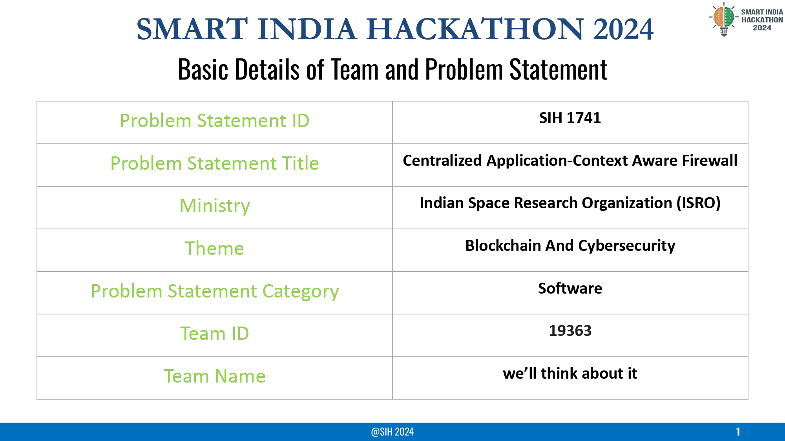
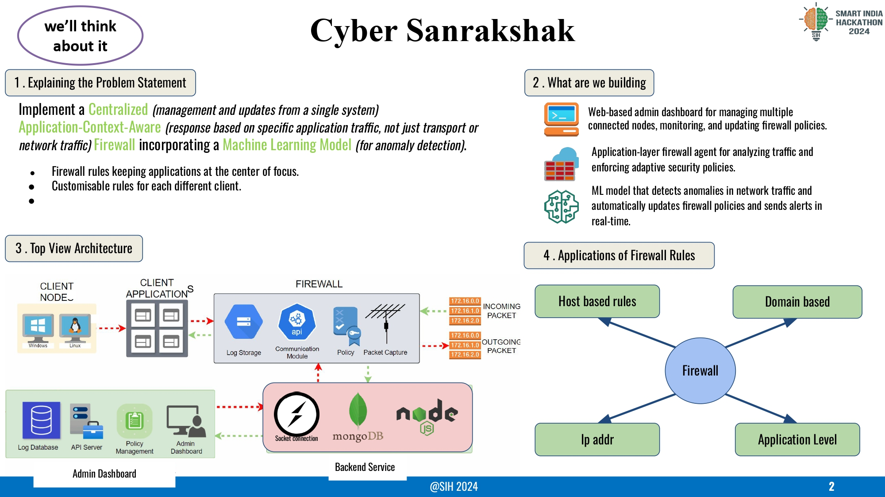
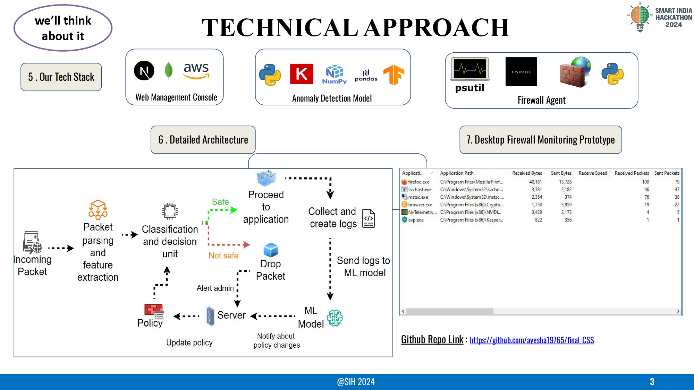
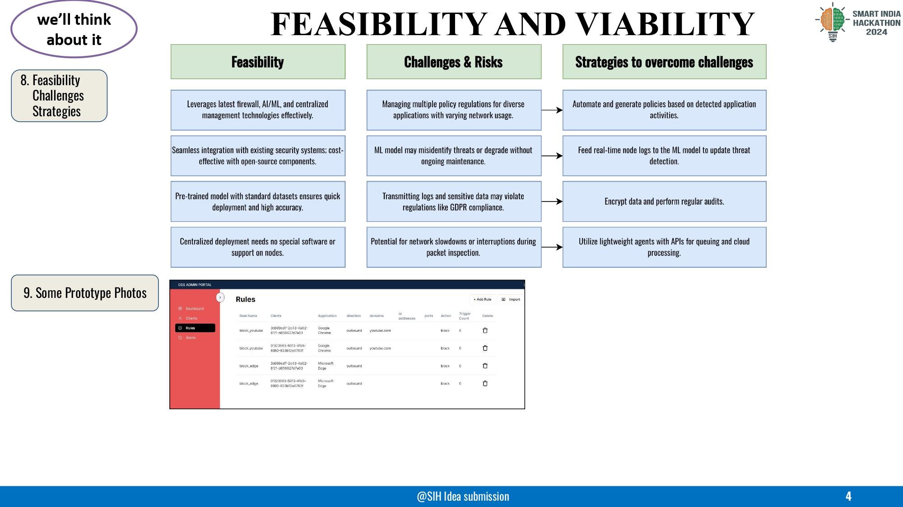
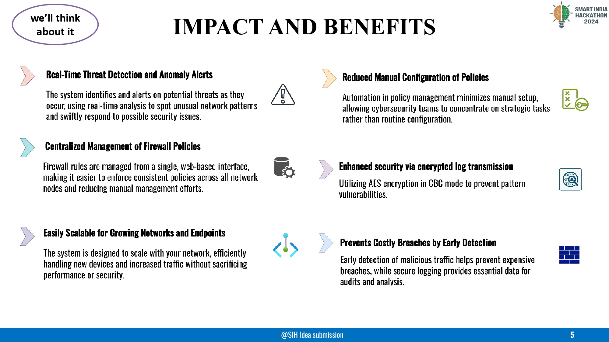
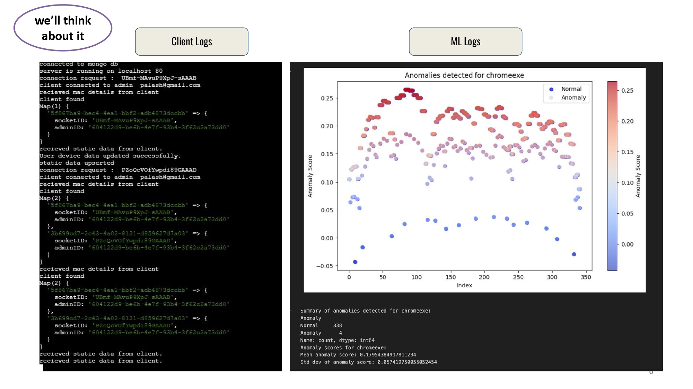
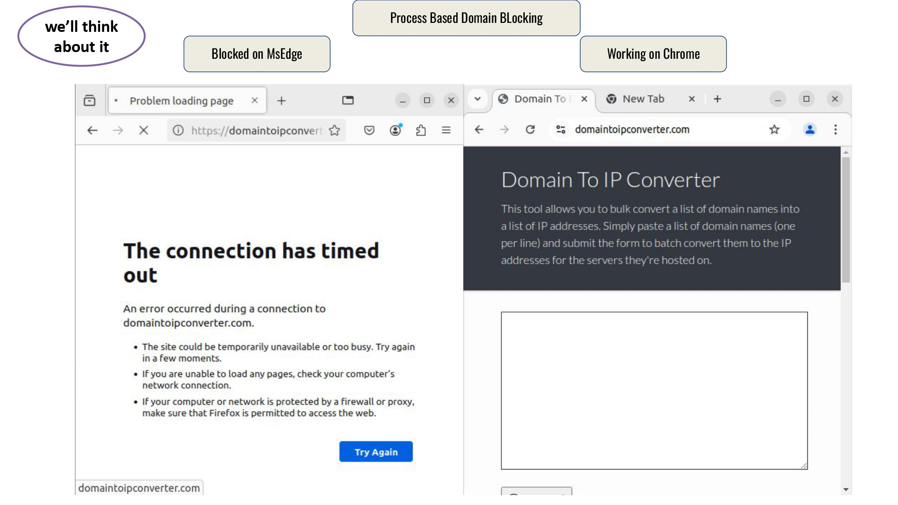

# Cyber Sanrakshak

> Advanced Context-Aware Firewall with ML-based Anomaly Detection

## Overview

Cyber Sanrakshak is a comprehensive security solution developed for Smart India Hackathon 2024, emerging victorious at the event. It combines traditional firewall capabilities with machine learning-powered anomaly detection to provide proactive network security management.

## Features

- **Smart Firewall Rules**: Domain, application, host, and IP-based filtering
- **ML Anomaly Detection**: Real-time threat detection using machine learning
- **Admin Dashboard**: Modern web interface for rule management and monitoring  
- **Cross-Platform Client**: Works on Windows and Linux systems
- **Real-time Monitoring**: Live network activity visualization and alerts

## Architecture

```
┌─────────────────┐    ┌─────────────────┐    ┌─────────────────┐
│   Frontend      │    │    Backend      │    │   ML Service    │
│   (Next.js)     │◄──►│   (Node.js)     │◄──►│   (Python)      │
└─────────────────┘    └─────────────────┘    └─────────────────┘
                                ▲
                                │
                        ┌─────────────────┐
                        │  Client Agent   │
                        │   (Python)      │
                        └─────────────────┘
```

## Tech Stack

- **Frontend**: Next.js, TypeScript, Tailwind CSS, shadcn/ui
- **Backend**: Node.js, Express, MongoDB, Socket.io
- **Client**: Python, Socket.io-client, psutil
- **ML Service**: Python, Suricata, XGBoost, TensorFlow
- **Database**: MongoDB

---
## PPT Slides:
To get a detailed walkthrough of the project, you can view the presentation slides:








## Quick Start

```bash
# Clone repository
git clone <repository-url>
cd CyberSanrakshak

# Install dependencies
npm install

# Start development environment
./scripts/dev.sh
```

**Access Points:**
- Frontend Dashboard: http://localhost:3000
- Backend API: http://localhost:5000

For detailed setup instructions, see [docs/SETUP.md](docs/SETUP.md)

## Usage

1. **Dashboard Access**: Login with admin credentials
2. **Rule Management**: Create and manage firewall rules through the web interface
3. **Real-time Monitoring**: View live network activity and security events
4. **Anomaly Detection**: Automatic threat detection with ML-powered insights
5. **Client Management**: Deploy agents on target systems for monitoring

## Project Structure

```
CyberSanrakshak/
├── packages/
│   ├── frontend/          # Next.js dashboard
│   ├── backend/           # Node.js API server  
│   ├── client/            # Python firewall agent
│   └── ml-service/        # ML anomaly detection
├── docs/                  # Documentation
├── scripts/               # Development scripts
└── assets/               # Project assets
```

---

## Contributors:  
- **xARSENICx**  
- **Palash Chitnavis**  
- **Ankesh Gupta**  
- **Mahesh Suryawanshi**  
- **Ayush Vishwakarma**  
- **Ayesha**  

---

## Acknowledgments:  

This project was inspired by research and practical implementations in the field of anomaly detection and web application firewalls:  
- [Web Application Firewall Using Machine Learning and Feature Engineering](https://doi.org/10.1155/2022/5280158)  
- [Anomaly Detection Using Machine Learning Techniques](https://ieeexplore.ieee.org/document/9033532)  

By developing Cyber Sanrakshak, our goal is to provide a secure, scalable, and efficient solution for modern network security challenges.  

**Made with Love 🧡**  

©2024 Cyber Sanrakshak Team. All rights reserved.  
